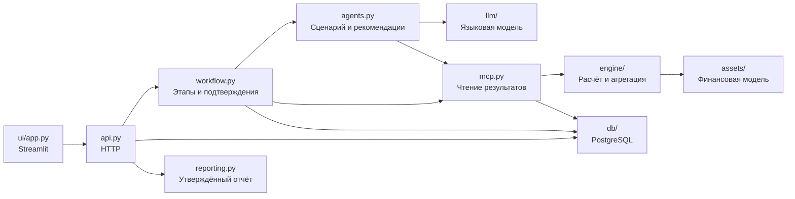

# Структура кейса

HTTP, этапы расчёта, LLM-агенты и отчёт находятся в отдельных модулях.
Пакеты `assets/`, `engine/`, `llm/` и `db/` содержат финансовую модель,
расчётную инфраструктуру, подключение LLM и хранение данных.

```text
macrostress-core/
├── src/msa/                     # Бэкенд
│   ├── __main__.py              # Запуск API
│   ├── api.py                   # HTTP-маршруты и выполнение этапов
│   ├── workflow.py              # Пять этапов LangGraph и подтверждения
│   ├── agents.py                # Сценарий и рекомендации LLM
│   ├── contracts.py             # Контракты Pydantic
│   ├── config.py                # Настройки из окружения
│   ├── mcp.py                   # Инструменты портфеля, расчёта и результатов
│   ├── reporting.py             # Факты, ссылки и Markdown-отчёт
│   ├── assets/                  # Финансовая модель
│   │   ├── __init__.py          # Реестр и каталог для интерфейса
│   │   ├── base.py              # Контракт модели и результат расчёта
│   │   └── corporate.py         # Корпоративный кредит
│   ├── engine/                  # Численная инфраструктура
│   │   ├── calendar.py          # Месяцы и число дней
│   │   ├── scenarios.py         # Общая выборка Соболя
│   │   └── pipeline.py          # Расчёт активов и агрегация портфеля
│   ├── llm/                     # Подключение языковой модели
│   │   ├── client.py            # HTTP и вызовы инструментов
│   │   ├── providers.py         # Профили mock / local / deepseek
│   │   ├── structured.py        # JSON-схемы и разбор ответов
│   │   ├── network.py           # Проверка адреса локальной модели
│   │   └── mock.py              # Автономная заглушка
│   └── db/                      # Хранение данных
│       ├── store.py             # Таблицы и снимки запусков
│       └── migrate.py           # Применение миграций
├── ui/
│   ├── app.py                   # Единственная страница Streamlit
│   └── assets/                  # Локальный шрифт и его лицензия
├── scripts/
│   ├── local_stack.py           # Запуск, остановка, статус и журналы
│   ├── init_env.py              # Первичное создание .env
│   └── rehearse.py              # Сквозная репетиция через API
├── migrations/
│   ├── versions/0002_product.py # Схема базы
│   ├── env.py                   # Окружение Alembic
│   ├── alembic.ini              # Настройки миграций
│   └── script.py.mako           # Шаблон новой миграции
├── demo/case.json               # Портфель, события и сценарий заглушки
├── tests/
│   ├── conftest.py              # Изолированные данные и настройки
│   ├── test_engine.py           # Формулы и портфельные квантили
│   ├── test_advice.py           # MCP, ссылки и диалог LLM
│   ├── test_workflow.py         # Подтверждения и восстановление
│   └── test_ui.py               # Полный путь через формы
├── docs/
│   ├── architecture.md          # Поток данных и HTTP
│   ├── asset-types.md           # Формулы и границы модели
│   ├── audit.md                 # Что исключено из кейса
│   └── structure.md             # Карта файлов и зависимостей
├── .streamlit/config.toml       # Тема и локальный сервер интерфейса
├── msa.ps1                      # Единая команда управления стендом
├── pyproject.toml               # Зависимости и настройки проверок
├── uv.lock                      # Закреплённые версии зависимостей
├── .python-version              # Версия Python
├── .env.example                 # Пример настроек без секретов
├── README.md                    # Запуск и прохождение кейса
└── PRODUCT.md                   # Назначение и ограничения
```

Служебные `__init__.py` в дереве опущены.
Локальные `.env`, `.venv/`, `.data/` и кэши не входят в исходный код.


